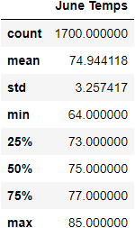
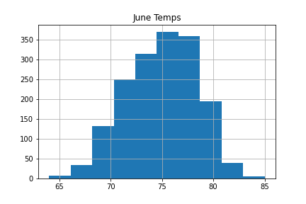
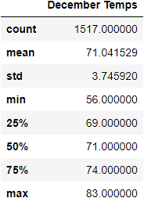
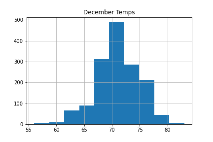

# surfs_up
## Background
W. Avy likes your analysis, but he wants more information about temperature trends before opening the surf shop. Specifically, he wants temperature data for the months of June and December in Oahu, in order to determine if the surf and ice cream shop business is sustainable year-round.

## Meathology
* Deliverable 1: Determine the Summary Statistics for June
* Deliverable 2: Determine the Summary Statistics for December
* Deliverable 3: A written report for the statistical analysis (README.md)

## Findings

#### June Weather Summary
The taverage temperture for June in Oahu, HI is 74.9 degrees F  
- the highest temperture observed was 85.0 degrees F
- the lowest temperture observed was 64.0 degrees F
- the range of tempertures observed was 21 degrees F 

#### December Weather Summary
The taverage temperture for June in Oahu, HI is 71.0 degrees F  
- the highest temperture observed was 83.0 degrees F
- the lowest temperture observed was 56.0 degrees F
- the range of tempertures observed was 27 degrees F

### Summary
*June tempertures are (on average) warmer than tempertures in December
* The range differences are around 6 degrees 

